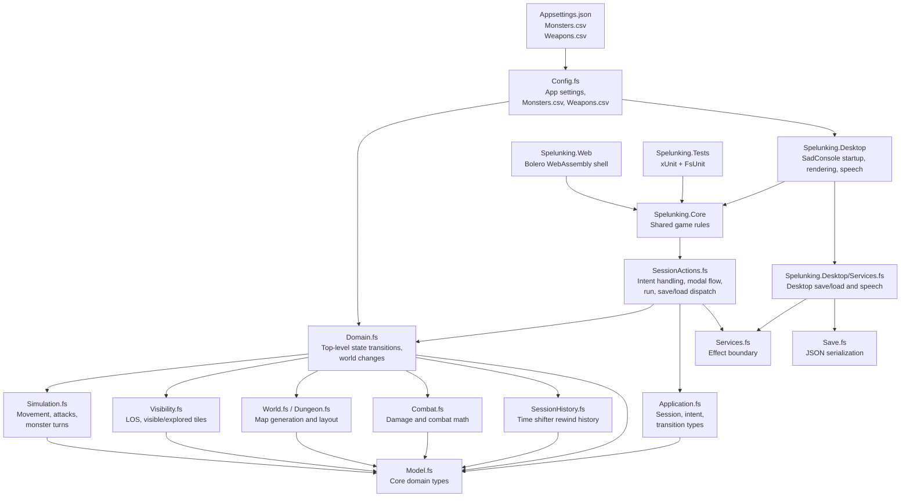
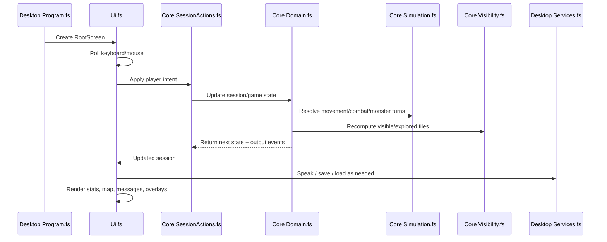

# Architecture

`Spelunk` is organized around a shared F# game core with host-specific presentation projects. The desktop host uses SadConsole/MonoGame, and the web host is a static Bolero WebAssembly client shell.

## High-Level Diagram

## Runtime Flow

## Module Boundaries

- Shared core:
  - `Spelunking.Core/Model.fs`
  - `Spelunking.Core/World.fs`
  - `Spelunking.Core/Dungeon.fs`
  - `Spelunking.Core/Visibility.fs`
  - `Spelunking.Core/Combat.fs`
  - `Spelunking.Core/Simulation.fs`
  - `Spelunking.Core/Domain.fs`
  - `Spelunking.Core/Application.fs`
  - `Spelunking.Core/SessionActions.fs`
  - `Spelunking.Core/SessionHistory.fs`
  - `Spelunking.Core/Input.fs`
  - `Spelunking.Core/Overlay.fs`
  - `Spelunking.Core/Save.fs`
  - `Spelunking.Core/Config.fs`
- Desktop host:
  - `Spelunking.Desktop/Program.fs`
  - `Spelunking.Desktop/Ui.fs`
  - `Spelunking.Desktop/Appearance.fs`
  - `Spelunking.Desktop/Services.fs`
- Web host:
  - `Spelunking.Web/Main.fs`
  - `Spelunking.Web/Startup.fs`
  - `Spelunking.Web/wwwroot/`

## Design Notes

- The preferred dependency direction is inward toward `Spelunking.Core`.
- Host projects should render state and trigger effects, not own gameplay rules.
- Host-specific services should stay thin and effect-focused.
- Gameplay content belongs in CSV/JSON data files rather than hardcoded tables where possible.
